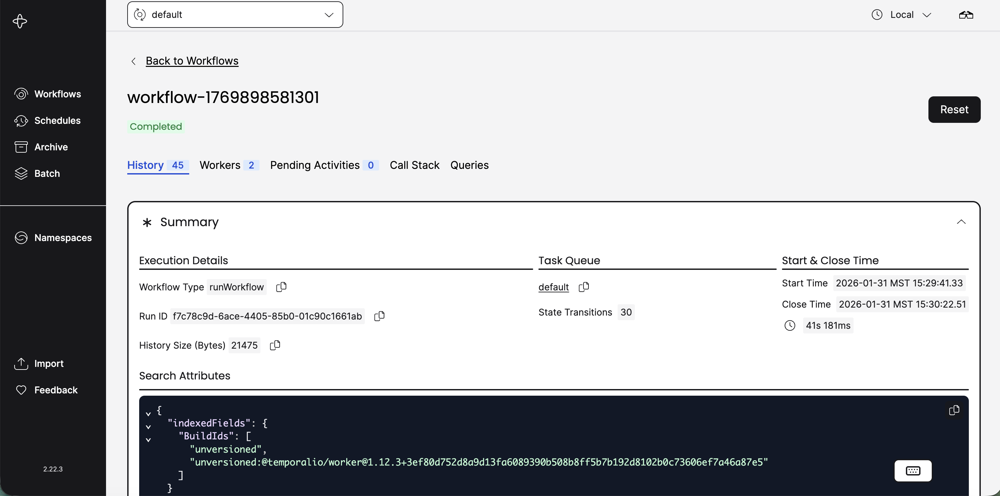
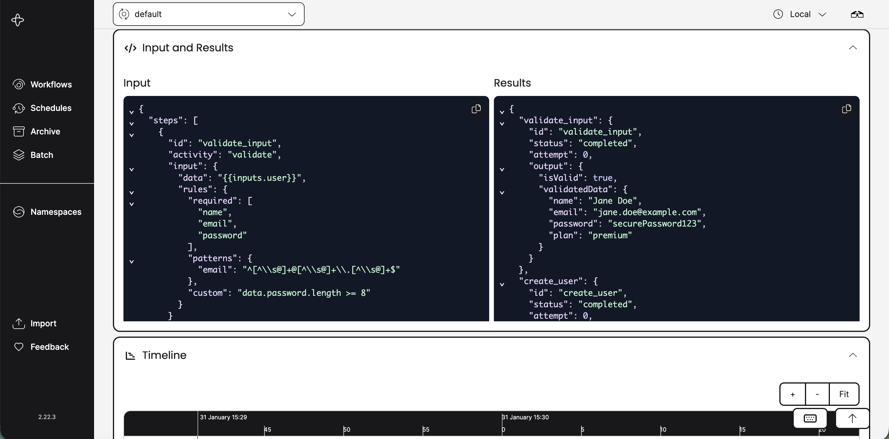
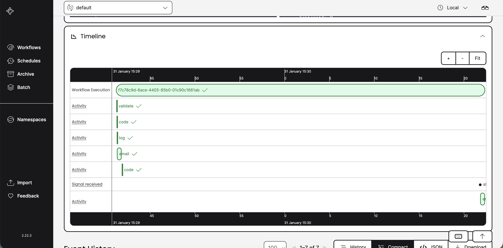
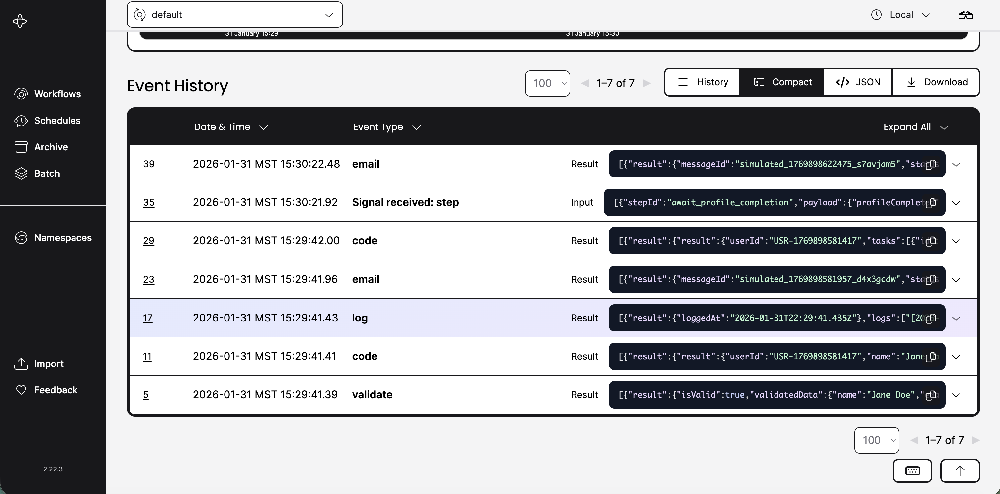

# Krama

<p align="center">
  <strong>क्रम | ক্রম — A declarative, YAML-based workflow engine powered by Temporal</strong>
</p>

<p align="center">
  <em>"Krama" (Sanskrit: क्रम, Bengali: ক্রম) means "sequence," "order," or "step" — perfectly capturing the essence of workflow orchestration.</em>
</p>

<p align="center">
  <a href="#features">Features</a> •
  <a href="#quick-start">Quick Start</a> •
  <a href="#documentation">Documentation</a> •
  <a href="#examples">Examples</a>
</p>

---

## Overview

Krama is a production-ready workflow engine that lets you define complex workflows in YAML and execute them as Directed Acyclic Graphs (DAGs) using Temporal. Perfect for orchestrating microservices, data pipelines, approval workflows, and more.

## Features

✨ **Declarative YAML DSL** - Define workflows without writing code

🔄 **DAG Execution** - Automatic dependency resolution and parallel execution

🎯 **Conditional Logic** - Skip steps based on runtime conditions

📨 **Signal Support** - Wait for external events and human approvals

⏱️ **Flexible Timeouts** - Per-step and workflow-level timeout controls

🔁 **Smart Retries** - Exponential backoff with configurable policies

🎨 **Mustache Templating** - Dynamic input resolution with context awareness

🛡️ **Type-Safe** - Full TypeScript implementation

🔌 **Extensible** - Easy to add custom activities

📊 **Observable** - Built-in Temporal UI for monitoring and debugging

## Quick Start

### Prerequisites

- **Node.js** 18+ and npm
- **Docker** and Docker Compose (for running Temporal)

### Installation

```bash
# Clone the repository
git clone https://github.com/kaushiksamanta/Krama.git
cd Krama

# Install dependencies
npm install

# Start Temporal server and UI
npm run temporal:up

# In another terminal, start the worker
npm run start-worker

# In a third terminal, run the example workflow
npm run example:client
```

That's it! Open http://localhost:8233 to see your workflow in the Temporal UI.

## Workflow Execution

Here's what a workflow execution looks like in the Temporal UI:

### Workflow Overview


### Workflow Timeline


### Step Details


### Workflow Results


## Documentation

### Architecture

See [docs/ARCHITECTURE.md](docs/ARCHITECTURE.md) for detailed architecture documentation.

The engine consists of three main components:

1. **Workflow Runner** (`src/workflow/`) - Executes DAG-based workflows with Temporal
2. **Node Plugins** (`src/nodes/`) - Extensible activity implementations
3. **DSL Loader** (`src/loader.ts`) - Parses and validates YAML workflow definitions

### Available Scripts

```bash
npm run temporal:up      # Start Temporal + UI with Docker Compose
npm run temporal:down    # Stop Temporal services
npm run start-worker     # Start workflow worker
npm run example:client   # Run example workflow
npm test                 # Run test suite
npm run build            # Build TypeScript
```

## Workflow Definition

Workflows are defined in YAML files with the following structure.

### Step Types

The engine supports three types of steps:

| Type | Description |
|------|-------------|
| `activity` | Execute a registered Temporal activity (default) |
| `signal` | Wait for an external signal/event |
| `code` | Execute inline JavaScript code (like n8n) |

```yaml
name: workflow-name
version: 1.0.0
description: Brief description of what this workflow does

# Define input schema
inputs:
  param1: string
  param2: number

# Define workflow steps
steps:
  - id: step1
    activity: activityName
    input:
      key: "{{inputs.param1}}"  # Use Mustache templating
    retry:                      # Optional: retry policy
      count: 3
      initialInterval: 1s
      backoffCoefficient: 2.0
    timeout:                    # Optional: per-step timeout
      startToClose: 30s

  - id: step2
    activity: anotherActivity
    dependsOn: ["step1"]        # Wait for step1 to complete
    when: "{{step.step1.result.success}}"  # Conditional execution
    input:
      data: "{{step.step1.result.data}}"

  - id: approval
    type: signal                # Wait for external signal
    activity: waitForApproval
    dependsOn: ["step2"]

  - id: step3
    activity: finalActivity
    dependsOn: ["approval"]
    when: "{{step.approval.result.approved}} == true"
```

### Templating

The engine uses Mustache.js for dynamic value resolution:

**Available Context:**
- `{{inputs.fieldName}}` - Access workflow inputs
- `{{step.stepId.result.field}}` - Access previous step outputs

**Examples:**

```yaml
# Pass entire object
data: "{{inputs.user}}"  # Resolves to the full user object

# Access nested fields
email: "{{inputs.user.email}}"

# Use previous step results
userId: "{{step.create_user.result.userId}}"

# String interpolation
message: "Hello {{inputs.user.name}}, your ID is {{step.create_user.result.userId}}"
```

### Conditional Execution

Use the `when` field to conditionally execute steps:

```yaml
- id: send_email
  activity: sendEmail
  when: "{{step.validation.result.isValid}}"  # Only if validation passed

- id: refund
  activity: processRefund
  when: "{{step.payment.result.status}} == 'failed'"  # Only if payment failed
```

### Code Steps (n8n-style)

Execute inline JavaScript code with full access to inputs and previous step results:

```yaml
- id: transform_data
  type: code
  input:
    items: "{{inputs.items}}"
    multiplier: 2
  code: |
    // Access input data
    const processed = input.items.map(item => ({
      ...item,
      value: item.value * input.multiplier,
      processedAt: new Date().toISOString()
    }));
    
    // Access workflow context
    console.log('Workflow inputs:', context.inputs);
    console.log('Previous steps:', Object.keys(context.steps));
    
    // Return value becomes step output
    return {
      items: processed,
      count: processed.length
    };
```

**Available in Code Steps:**

| Variable | Description |
|----------|-------------|
| `input` | Resolved input object from the step definition |
| `context.inputs` | Original workflow inputs |
| `context.steps` | Results from all completed steps |
| `console` | Logging (log, info, warn, error, debug) |
| `JSON`, `Math`, `Date`, `Array`, `Object` | Standard JavaScript globals |

**Code Step Features:**
- Async/await support
- Automatic error handling with retries
- Console output captured in logs
- Sandboxed execution for security

### Signal Steps

Wait for external events or human approvals:

```yaml
- id: approval
  type: signal
  activity: waitForApproval  # Activity name is ignored
  dependsOn: ["previous_step"]
```

Send signals from your client:

```typescript
import { Connection, WorkflowClient } from '@temporalio/client';

const connection = await Connection.connect({ address: 'localhost:7233' });
const client = new WorkflowClient({ connection });
const handle = client.getHandle('workflow-id');

// Send signal with payload
await handle.signal('step', 'approval', { approved: true, comment: 'LGTM' });
```

## Examples

### Data Processing Pipeline (Code Steps)

See `dsl/data-processing.workflow.yaml` for a complete example using code steps:

```yaml
name: data-processing-pipeline
steps:
  # Calculate totals with JavaScript
  - id: calculate_totals
    type: code
    input:
      orders: "{{inputs.orders}}"
      taxRate: "{{inputs.taxRate}}"
    code: |
      const processedOrders = input.orders.map(order => {
        const subtotal = order.items.reduce((sum, item) => 
          sum + (item.quantity * item.price), 0);
        const tax = subtotal * input.taxRate;
        return { ...order, subtotal, tax, total: subtotal + tax };
      });
      return { orders: processedOrders };

  # Use previous step results
  - id: apply_discounts
    type: code
    dependsOn: ["calculate_totals"]
    input:
      orders: "{{step.calculate_totals.result.orders}}"
    code: |
      return input.orders.map(order => ({
        ...order,
        discount: order.total > 100 ? order.total * 0.1 : 0
      }));
```

### User Registration Workflow

See `dsl/example.workflow.yaml` for a complete example:

```yaml
name: user-registration
steps:
  - id: validate_input
    activity: validateInput
    input:
      data: "{{inputs.user}}"
      rules:
        required: ["name", "email", "password"]

  - id: create_user
    activity: createUser
    dependsOn: ["validate_input"]
    when: "{{step.validate_input.result.isValid}}"
    input:
      name: "{{inputs.user.name}}"
      email: "{{inputs.user.email}}"
      password: "{{inputs.user.password}}"

  - id: send_welcome_email
    activity: sendEmail
    dependsOn: ["create_user"]
    input:
      to: "{{inputs.user.email}}"
      subject: "Welcome {{inputs.user.name}}!"
```

### Built-in Nodes

The engine includes these node plugins (see `src/nodes/`):

- **`http`** - Make HTTP requests to external APIs
- **`code`** - Execute inline JavaScript in a sandboxed environment
- **`email`** - Send emails via SMTP
- **`log`** - Structured audit logging
- **`validate`** - Data validation with rules
- **`transform`** - Data transformation (pick, omit, map, filter, sort)
- **`wait`** - Delay execution

### Adding Custom Nodes

1. Create a new node using the CLI:

```bash
npm run create-node my-custom-node
```

2. Implement your node in `src/nodes/my-custom-node.v1.node.ts`

3. Use it in your workflow YAML:

```yaml
- id: custom_step
  activity: my-custom-node
  input:
    data: "{{inputs.someValue}}"
```

## Error Handling

**Automatic Retries:**
```yaml
retry:
  count: 3                    # Retry up to 3 times
  initialInterval: 1s         # Wait 1s before first retry
  backoffCoefficient: 2.0     # Double wait time each retry
```

**Dependency Propagation:**
- Failed steps cause dependent steps to be skipped
- Skipped steps propagate to their dependents
- View full execution history in Temporal UI

**Workflow Signals:**
- `cancel` - Cancel workflow execution
- `step` - Deliver payload to signal steps

### Development Setup

```bash
# Install dependencies
npm install

# Run tests
npm test

# Run tests in watch mode
npm test -- --watch

# Build TypeScript
npm run build
```

### Project Structure

```
.
├── src/
│   ├── workflow/             # Workflow execution module
│   │   ├── WorkflowExecutor.ts
│   │   ├── StepExecutor.ts
│   │   └── utils.ts
│   ├── nodes/                # Node plugins
│   │   ├── http.v1.node.ts
│   │   ├── code.v1.node.ts
│   │   ├── email.v1.node.ts
│   │   └── ...
│   ├── types/                # TypeScript type definitions
│   ├── loader.ts             # YAML DSL parser
│   ├── toposort.ts           # DAG validation and sorting
│   └── startWorkflow.ts      # CLI and worker entrypoint
├── docs/
│   └── ARCHITECTURE.md       # Detailed architecture docs
├── dsl/
│   └── example.workflow.yaml # Example workflow definition
├── client/
│   └── startExampleWorkflow.ts
├── tests/
└── docker-compose.yml        # Temporal + UI setup
```

## Roadmap

- [ ] Workflow versioning and migration support
- [ ] Parallel execution groups
- [ ] Dynamic workflow generation
- [ ] Workflow composition (sub-workflows)
- [ ] Enhanced monitoring and metrics
- [ ] GraphQL/REST API for workflow management
- [ ] Visual workflow editor

## License

MIT License - see [LICENSE](LICENSE) file for details

## Acknowledgments

- Built with [Temporal](https://temporal.io/)
- Inspired by Airflow, Prefect, and Argo Workflows
- DAG implementation using [dependency-graph](https://github.com/jriecken/dependency-graph)
