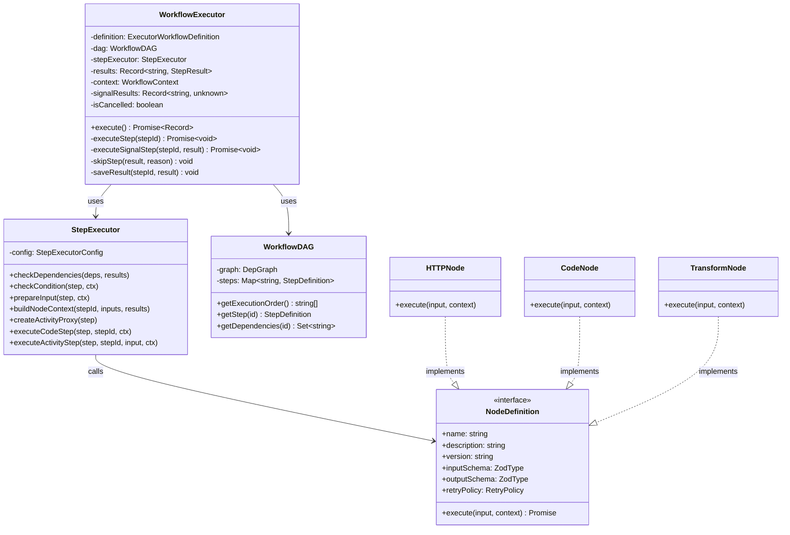

# Architecture

## Overview

The Temporal Workflow Engine is a declarative workflow orchestration system that executes YAML-defined workflows as Directed Acyclic Graphs (DAGs). It leverages Temporal's durability and reliability while providing a simple, code-free workflow definition experience.

## High-Level Architecture


## Directory Structure

```
src/
├── types/                    # Centralized type definitions
│   ├── index.ts              # Main export (re-exports all types)
│   ├── core.ts               # StepDefinition, StepResult, WorkflowContext
│   ├── node.ts               # NodeDefinition, NodeContext, NodeExecutionError
│   └── workflow.ts           # ExecutorWorkflowDefinition, TemplateContext
│
├── workflow/                 # Workflow execution module
│   ├── index.ts              # Entry point, exports runWorkflow
│   ├── WorkflowExecutor.ts   # Orchestrates DAG execution
│   ├── StepExecutor.ts       # Handles individual step execution
│   └── utils.ts              # Template rendering, duration parsing
│
├── nodes/                    # Plugin-based node system
│   ├── index.ts              # Node registry, activity wrapper creation
│   ├── code.v1.node.ts       # Execute inline JavaScript
│   ├── http.v1.node.ts       # HTTP requests
│   ├── log.v1.node.ts        # Audit logging
│   ├── email.v1.node.ts      # Email sending
│   ├── validate.v1.node.ts   # Data validation
│   ├── wait.v1.node.ts       # Delay/sleep
│   └── transform.v1.node.ts  # Data transformation
│
├── workflow.ts               # Re-exports from workflow/
├── types.ts                  # Re-exports from types/
├── loader.ts                 # YAML DSL parser
├── toposort.ts               # DAG validation & topological sort
└── startWorkflow.ts          # Temporal worker entry point
```

## Class Diagram



## Sequence Diagram: Workflow Execution

```mermaid
sequenceDiagram
    participant Client
    participant Worker
    participant WE as WorkflowExecutor
    participant SE as StepExecutor
    participant Node as Node Plugin

    Client->>Worker: start workflow
    Worker->>WE: new(definition)
    WE->>SE: new(config)
    Worker->>WE: execute()
    
    loop For each step in topological order
        WE->>SE: checkDependencies()
        SE-->>WE: {shouldSkip, reason}
        WE->>SE: checkCondition()
        SE-->>WE: {shouldSkip, reason}
        WE->>SE: prepareInput()
        SE-->>WE: activityInput
        WE->>SE: executeActivityStep()
        SE->>Node: execute(input, context)
        Node-->>SE: result
        SE-->>WE: output
        WE->>WE: saveResult()
    end
    
    WE-->>Worker: results
    Worker-->>Client: workflow results
```



## Node Plugin Architecture


### Node Execution Flow


## Core Components

### 1. Workflow Module (`src/workflow/`)

The workflow execution module is structured as follows:

#### WorkflowExecutor (`WorkflowExecutor.ts`)

Orchestrates the entire workflow execution:

- **DAG Management**: Creates and traverses the workflow DAG
- **Signal Handling**: Sets up handlers for cancel and step signals
- **Step Orchestration**: Iterates through steps in topological order
- **State Management**: Tracks results and context across steps

```typescript
class WorkflowExecutor {
  constructor(definition: ExecutorWorkflowDefinition)
  async execute(): Promise<Record<string, StepResult>>
  private async executeStep(stepId: string): Promise<void>
  private async executeSignalStep(stepId: string, result: StepResult): Promise<void>
  private skipStep(result: StepResult, reason: string): void
  private saveResult(stepId: string, result: StepResult): void
}
```

#### StepExecutor (`StepExecutor.ts`)

Handles individual step execution:

- **Dependency Checking**: Validates step dependencies are met
- **Condition Evaluation**: Evaluates `when` clauses
- **Input Preparation**: Renders Mustache templates
- **Activity Execution**: Creates Temporal activity proxies with retry policies

```typescript
class StepExecutor {
  constructor(config: StepExecutorConfig)
  checkDependencies(deps: Set<string>, results: Record<string, StepResult>)
  checkCondition(step: StepDefinition, ctx: TemplateContext)
  prepareInput(step: StepDefinition, ctx: TemplateContext)
  buildNodeContext(stepId: string, inputs: Record, results: Record)
  createActivityProxy(step: StepDefinition)
  async executeCodeStep(step: StepDefinition, stepId: string, ctx: NodeContext)
  async executeActivityStep(step: StepDefinition, stepId: string, input: Record, ctx: NodeContext)
}
```

#### Utils (`utils.ts`)

Utility functions for workflow execution:

- `parseDurationToMs(duration)` - Parse duration strings using `ms` library. **Throws an error** for invalid formats (e.g., `'invalid'`) rather than silently returning 0.
- `buildTemplateContext(inputs, results)` - Build Mustache context
- `renderValue(value, context)` - Recursively render templates, preserving object types for single mustache tags
- `resolvePath(obj, path)` - Resolve dot-notation paths
- `evaluateCondition(condition, context)` - Evaluate `when` clauses. Returns `false` (step skipped) for:
  - Empty string `''`
  - The string `'false'`
  - The string `'0'`

### 2. Node Plugin System (`src/nodes/`)

Plugin-based architecture for extensible activities:

#### Node Definition Interface

```typescript
interface NodeDefinition<TInput, TOutput> {
  name: string;                    // Unique node name
  description: string;             // Human-readable description
  version: string;                 // Semver version
  inputSchema?: ZodType<TInput>;   // Input validation
  outputSchema?: ZodType<TOutput>; // Output documentation
  retryPolicy?: RetryPolicy;       // Default retry config
  execute(input: TInput, context: NodeContext): Promise<TOutput>;
}
```

#### Available Nodes

| Node | Description | Key Features |
|------|-------------|--------------|
| `http` | HTTP requests | GET/POST/PUT/DELETE, headers, body |
| `code` | JavaScript execution | Sandboxed VM, async/await support, Promise-based timeout |
| `log` | Audit logging | Structured JSON output |
| `email` | Send emails | SMTP config detection, simulation mode (always returns `'simulated'` status until SMTP is fully implemented) |
| `validate` | Data validation | Required, types, patterns, custom |
| `wait` | Delay execution | Duration strings (5s, 1m, 2h) |
| `transform` | Data transformation | pick, omit, map, filter, sort (with index-aware error messages) |

### 3. DSL Loader (`src/loader.ts`)

Parses and validates YAML workflow definitions:

- Loads YAML files
- Validates structure (name, steps, etc.)
- Checks for duplicate step IDs
- Validates dependencies exist
- Returns typed `WorkflowDefinition`

### 4. DAG Validator (`src/toposort.ts`)

Ensures workflow integrity:

- Detects circular dependencies
- Validates all dependencies exist
- Provides topological execution order
- Uses `dependency-graph` library

### 5. Type System (`src/types/`)

Centralized TypeScript types organized by domain:

| File | Types |
|------|-------|
| `core.ts` | `StepDefinition`, `StepResult`, `WorkflowContext`, `WorkflowDefinition` |
| `node.ts` | `NodeDefinition`, `NodeContext`, `NodeLogger`, `NodeExecutionError` |
| `workflow.ts` | `ExecutorWorkflowDefinition`, `TemplateContext`, `NodeActivityResult` |

## Data Flow


## Execution Model

### Step Execution Order

1. **Topological Sort**: Steps are sorted based on dependencies
2. **Parallel Execution**: Independent steps run in parallel
3. **Sequential Dependencies**: Dependent steps wait for prerequisites
4. **Conditional Skipping**: Steps with unmet `when` conditions are skipped
5. **Error Propagation**: Failed/skipped steps cause dependents to skip

### Templating Resolution

```typescript
// Context available to Mustache templates
{
  inputs: {
    // Workflow inputs
    user: { name: "Alice", email: "alice@example.com" }
  },
  step: {
    // Previous step results
    validate_input: {
      result: { isValid: true }
    },
    create_user: {
      result: { userId: "user_123", status: "active" }
    }
  }
}
```

### Signal Handling

Signal steps pause workflow execution until an external signal arrives:

1. Step marked with `type: signal`
2. Workflow waits at that step
3. External client sends signal: `handle.signal('step', stepId, payload)`
4. Workflow resumes with signal payload as step result

## Temporal Integration

### Workflow Function

- **Deterministic**: Uses Temporal's deterministic APIs
- **Durable**: Survives worker restarts
- **Versioned**: Can be updated with Temporal's versioning

### Activities

- **Idempotent**: Should handle retries gracefully
- **Timeout-aware**: Respect configured timeouts
- **Retryable**: Automatic retry with exponential backoff

### Worker

- Bundles workflow code with Webpack
- Registers activities
- Polls task queue for work
- Executes workflows and activities

## Scalability Considerations

### Horizontal Scaling

- **Multiple Workers**: Run multiple worker processes
- **Task Queues**: Partition work across queues
- **Activity Workers**: Separate activity-only workers

### Performance

- **Parallel Execution**: Independent steps run concurrently
- **Efficient Templating**: Lazy evaluation of templates
- **Minimal State**: Only store step results needed for templating

### Reliability

- **Automatic Retries**: Configurable per-step retry policies
- **Durable Execution**: Temporal ensures workflow completion
- **Failure Isolation**: Failed steps don't crash entire workflow

## Extension Points

### 1. Custom Activities

Add new activities in `src/activities.ts`:

```typescript
export const activities = {
  async myActivity(input: MyInput): Promise<MyOutput> {
    // Your logic here
  }
};
```

### 2. Custom Validation

Extend `loader.ts` to add custom validation rules.

### 3. Middleware

Add pre/post-processing hooks in the workflow runner.

### 4. Custom Templating

Replace Mustache with another templating engine.

## Security Considerations

1. **Input Validation**: Validate all workflow inputs
2. **Activity Isolation**: Activities should not trust workflow data
3. **Secrets Management**: Use environment variables or secret stores
4. **Access Control**: Implement authorization in activities
5. **Audit Logging**: Log all workflow executions

## Monitoring & Observability

### Temporal UI

- View workflow execution history
- Inspect step results and errors
- Replay workflows for debugging
- Monitor worker health

### Logging

- Workflow logs appear in Temporal UI
- Activity logs in worker output
- Structured logging with context

### Metrics

- Workflow duration
- Step execution times
- Retry counts
- Error rates

## Future Enhancements

1. **Workflow Composition**: Support sub-workflows
2. **Dynamic Workflows**: Generate workflows programmatically
3. **Parallel Groups**: Execute multiple steps in parallel explicitly
4. **Workflow Versioning**: Migrate running workflows to new versions
5. **Visual Editor**: Web-based workflow designer
6. **API Layer**: REST/GraphQL API for workflow management
