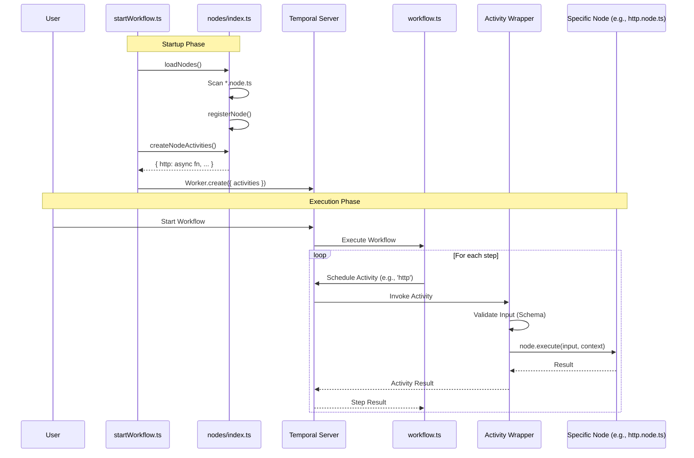

# PRD: Plugin-Based Node Architecture

**Version:** 1.0.0  
**Status:** Draft  
**Author:** Kaushik Samanta
**Date:** November 2025

---

## 1. Overview

### 1.1 Summary

Refactor the workflow engine to use a plugin-based node architecture where each node is a self-contained TypeScript file with a standardized interface. Nodes are auto-discovered from a dedicated directory and registered as Temporal activities.

### 1.2 Goals

- **Extensibility**: Contributors can add new nodes by creating a single TypeScript file
- **Consistency**: All nodes follow the same interface and patterns
- **Type Safety**: Strong typing for inputs, outputs, and validation
- **Self-Documentation**: Each node includes its own schema and description
- **Testability**: Nodes can be unit tested in isolation
- **Maintainability**: Clear separation of concerns, one file per node

### 1.3 Non-Goals

- Async initialization (connection pooling, etc.) - deferred to future version
- Visual node editor - out of scope
- Node marketplace/registry - out of scope
- Runtime node loading (hot reload) - out of scope

---

## 2. Architecture

### 2.1 System Flow

#### Startup Phase
1. **Worker Starts (`startWorkflow.ts`)**: The worker entry point initializes.
2. **Load Nodes (`nodes/index.ts`)**: `loadNodes()` scans the `src/nodes/` directory.
3. **Register Nodes**: Each valid `.node.ts` file is imported, and `registerNode()` stores it in the `nodeRegistry`.
4. **Create Activities**: `createNodeActivities()` iterates through the registry and wraps each `node.execute()` in a Temporal Activity wrapper.
5. **Register with Temporal**: The generated activities are registered with the Temporal Worker.

#### Execution Phase
1. **Workflow Triggered**: A user starts a workflow execution.
2. **Workflow Logic (`workflow.ts`)**: The Temporal Workflow executes the DAG steps.
3. **Activity Call**: When a step is reached (e.g., `type: http`), the workflow calls the corresponding activity (e.g., `activities.http`).
4. **Activity Wrapper**: The generated activity wrapper receives the call.
   - Creates `NodeContext` (logger, workflow info).
   - **Validates Input**: Checks input against `node.inputSchema`.
   - **Executes Node**: Calls `node.execute(input, context)`.
5. **Node Execution**: The specific node logic runs (e.g., `fetch()`).
6. **Return**: Result is returned to the workflow, stored in `stepResults`, and available for subsequent steps.

#### Sequence Diagram



### 2.2 Directory Structure

```
src/
├── nodes/                      # Plugin directory - each file is a node
│   ├── index.ts                # Auto-discovery, registration, activity generation
│   ├── types.ts                # Shared interfaces (NodeDefinition, NodeContext, etc.)
│   ├── base.v1.node.ts         # Optional base class with common utilities
│   ├── code.v1.node.ts         # Execute inline JavaScript code
│   ├── http.v1.node.ts         # HTTP/REST API calls
│   ├── log.v1.node.ts          # Audit logging
│   ├── email.v1.node.ts        # Send emails
│   ├── validate.v1.node.ts     # Input validation
│   ├── wait.v1.node.ts         # Delay/sleep
│   └── transform.v1.node.ts    # Data transformation utilities
├── cli/
│   └── create-node.ts          # CLI tool to scaffold new nodes
├── workflow.ts                 # Updated to use node system
├── loader.ts                   # YAML loader (unchanged)
├── toposort.ts                 # DAG utilities (unchanged)
├── types.ts                    # Workflow types (unchanged)
└── startWorkflow.ts            # Worker entry point (updated)
```

### 2.3 Node Interface

```typescript
// src/nodes/types.ts

import { z } from 'zod';

// ============================================================
// Logger (interface only - functions can't be Zod validated)
// ============================================================

/**
 * Logger interface available to nodes.
 * Note: Functions cannot be validated with Zod, so this remains an interface.
 */
export interface NodeLogger {
  debug(message: string, ...args: unknown[]): void;
  info(message: string, ...args: unknown[]): void;
  warn(message: string, ...args: unknown[]): void;
  error(message: string, ...args: unknown[]): void;
}

// ============================================================
// Node Context Schema
// ============================================================

/**
 * Zod schema for workflow metadata.
 */
export const WorkflowMetaSchema = z.object({
  id: z.string(),
  name: z.string(),
});

/**
 * Zod schema for step metadata.
 */
export const StepMetaSchema = z.object({
  id: z.string(),
  attempt: z.number().int().min(1),
});

/**
 * Zod schema for NodeContext (serializable parts only).
 * Used for validation when passing context between boundaries.
 */
export const NodeContextSchema = z.object({
  workflowInputs: z.record(z.unknown()),
  stepResults: z.record(z.unknown()),
  workflow: WorkflowMetaSchema,
  step: StepMetaSchema,
});

/** Inferred type from NodeContextSchema */
export type NodeContextData = z.infer<typeof NodeContextSchema>;

/** Full NodeContext including non-serializable logger */
export interface NodeContext extends NodeContextData {
  logger: NodeLogger;
}

// ============================================================
// Node Definition Schema
// ============================================================

/**
 * Zod schema for NodeDefinition metadata (without execute function).
 * Used for validation and documentation generation.
 */
export const NodeDefinitionMetaSchema = z.object({
  name: z.string().min(1).regex(/^[a-z][a-z0-9-]*$/, 'Must be lowercase with hyphens'),
  description: z.string().min(1),
  version: z.string().regex(/^\d+\.\d+\.\d+$/, 'Must be semver format (e.g., 1.0.0)'),
});

/** Inferred type from NodeDefinitionMetaSchema */
export type NodeDefinitionMeta = z.infer<typeof NodeDefinitionMetaSchema>;

/**
 * Full NodeDefinition interface including schemas and execute function.
 * Note: The execute function and Zod schemas themselves can't be Zod-validated,
 * so this remains a TypeScript interface that extends the validated metadata.
 */
export interface NodeDefinition<TInput = unknown, TOutput = unknown> extends NodeDefinitionMeta {
  /** Zod schema for input validation */
  inputSchema?: z.ZodType<TInput>;
  
  /** Zod schema for output documentation */
  outputSchema?: z.ZodType<TOutput>;
  
  /** The main execution function */
  execute(input: TInput, context: NodeContext): Promise<TOutput>;
}

// ============================================================
// Node Execution Result Schema
// ============================================================

/**
 * Zod schema factory for node execution result.
 * @param outputSchema - The Zod schema for the output type
 */
export const NodeExecutionResultSchema = <T extends z.ZodType>(outputSchema: T) =>
  z.object({
    success: z.boolean(),
    output: outputSchema.optional(),
    error: z.string().optional(),
    logs: z.array(z.string()),
    executionTime: z.number().min(0),
  });

/** Generic type for execution result */
export type NodeExecutionResult<T = unknown> = {
  success: boolean;
  output?: T;
  error?: string;
  logs: string[];
  executionTime: number;
};
```

**Design Notes:**
- **`NodeLogger`**: Remains a TypeScript interface because functions cannot be validated with Zod
- **`NodeContextSchema`**: Validates the serializable parts of context (useful when passing between workers)
- **`NodeContext`**: Extends the inferred type and adds the non-serializable `logger`
- **`NodeDefinitionMetaSchema`**: Validates node metadata (name, description, version)
- **`NodeDefinition`**: Extends validated metadata and adds `inputSchema`, `outputSchema`, and `execute()` which can't be Zod-validated
- **`NodeExecutionResultSchema`**: A factory function that creates a result schema with the correct output type

### 2.4 Context Lifecycle & Temporal State

**Important:** `NodeContext` is NOT persisted in Temporal's workflow state. It is reconstructed for each activity call.

#### What Temporal Persists (Workflow State)
```typescript
// Inside workflow.ts - these are persisted in Temporal's event history
const workflowInputs: Record<string, unknown>;  // Original inputs, immutable
const stepResults: Record<string, unknown>;      // Accumulated after each step
```

#### What Each Node Receives
```typescript
// Reconstructed for each activity call
const context: NodeContext = {
  workflowInputs,           // Passed from workflow state
  stepResults,              // Passed from workflow state (results so far)
  workflow: { id, name },   // Extracted from Temporal workflow info
  step: { id, attempt },    // Current step being executed
  logger,                   // Created fresh for each execution
};
```

#### How It Works

```
┌─────────────────────────────────────────────────────────────────┐
│                    Temporal Workflow State                       │
│  ┌─────────────────┐  ┌──────────────────────────────────────┐  │
│  │ workflowInputs  │  │ stepResults                          │  │
│  │ { user: {...} } │  │ { validate_user: {...},              │  │
│  │                 │  │   check_existing: {...}, ... }       │  │
│  └─────────────────┘  └──────────────────────────────────────┘  │
└─────────────────────────────────────────────────────────────────┘
                              │
                              ▼ (passed to each activity)
┌─────────────────────────────────────────────────────────────────┐
│                    Activity Execution                            │
│                                                                  │
│  1. Workflow calls activity with { input, contextData }         │
│  2. Activity wrapper creates logger                              │
│  3. Activity wrapper builds full NodeContext                     │
│  4. Node.execute(input, context) runs                           │
│  5. Result returned to workflow                                  │
│  6. Workflow stores result in stepResults[stepId]               │
│                                                                  │
└─────────────────────────────────────────────────────────────────┘
```

#### Accessing Previous Step Results

Every node can access results from completed steps via `context.stepResults`:

```typescript
async execute(input: MyInput, context: NodeContext): Promise<MyOutput> {
  // Access previous step results
  const httpResult = context.stepResults['fetch_data'] as HttpOutput;
  const validationResult = context.stepResults['validate_user'] as ValidateOutput;
  
  // Access original workflow inputs
  const userId = context.workflowInputs['userId'] as string;
  
  // Use in your logic
  if (httpResult?.status === 200) {
    // ...
  }
}
```

#### Why This Design?

1. **Temporal Best Practice**: Activities should be stateless; state lives in the workflow
2. **Replay Safety**: Temporal replays workflows; context must be reconstructable
3. **Serialization**: Only serializable data crosses the workflow-activity boundary
4. **Isolation**: Each node execution is independent and can be retried

### 2.5 Node Discovery & Registration

```typescript
// src/nodes/index.ts

import * as fs from 'fs';
import * as path from 'path';
import { pathToFileURL, fileURLToPath } from 'url';
import { NodeDefinition, NodeContext, NodeLogger, NodeExecutionError } from './types.js';

// Store all registered nodes (name -> version -> node)
const nodeRegistry: Map<string, Map<number, NodeDefinition>> = new Map();

/**
 * Register a node in the registry.
 */
export function registerNode(node: NodeDefinition): void {
  const version = parseVersion(node.version);
  
  if (!nodeRegistry.has(node.name)) {
    nodeRegistry.set(node.name, new Map());
  }
  
  const versions = nodeRegistry.get(node.name)!;
  if (versions.has(version)) {
    throw new Error(`Node '${node.name}' v${version} is already registered`);
  }
  
  versions.set(version, node);
  console.log(`Registered node: ${node.name}@v${version}`);
}

/**
 * Get a node by name and optional version.
 */
export function getNode(name: string, version?: number): NodeDefinition | undefined {
  const versions = nodeRegistry.get(name);
  if (!versions) return undefined;
  
  if (version !== undefined) {
    return versions.get(version);
  }
  
  // Return latest version
  const latestVersion = Math.max(...versions.keys());
  return versions.get(latestVersion);
}

/**
 * Parse version string to major version number.
 */
function parseVersion(version: string): number {
  const match = version.match(/^(\d+)/);
  return match ? parseInt(match[1], 10) : 1;
}

/**
 * Create a logger for node execution.
 */
function createLogger(stepId: string): { logger: NodeLogger; logs: string[] } {
  const logs: string[] = [];
  const format = (level: string, msg: string) => {
    const entry = `[${new Date().toISOString()}] [${level}] [${stepId}] ${msg}`;
    logs.push(entry);
    return entry;
  };
  
  return {
    logs,
    logger: {
      debug: (msg, ...args) => console.debug(format('DEBUG', msg), ...args),
      info: (msg, ...args) => console.info(format('INFO', msg), ...args),
      warn: (msg, ...args) => console.warn(format('WARN', msg), ...args),
      error: (msg, ...args) => console.error(format('ERROR', msg), ...args),
    },
  };
}

/**
 * Generate Temporal activities from all registered nodes.
 */
export function createNodeActivities(): Record<string, Function> {
  const activities: Record<string, Function> = {};

  for (const [name, versions] of nodeRegistry) {
    // Register each version as name@vN
    for (const [version, node] of versions) {
      const versionedName = `${name}@v${version}`;
      activities[versionedName] = createActivityWrapper(node);
    }
    
    // Register latest as just name
    const latestVersion = Math.max(...versions.keys());
    const latestNode = versions.get(latestVersion)!;
    activities[name] = createActivityWrapper(latestNode);
  }

  return activities;
}

/**
 * Create an activity wrapper for a node.
 */
function createActivityWrapper(node: NodeDefinition) {
  return async (params: {
    input: unknown;
    context: Omit<NodeContext, 'logger'>;
  }) => {
    const { logger, logs } = createLogger(params.context.step.id);
    const fullContext: NodeContext = { ...params.context, logger };

    // Validate input if schema is provided
    if (node.inputSchema) {
      const validation = validateInput(params.input, node.inputSchema);
      if (!validation.valid) {
        throw new NodeExecutionError(
          node.name,
          `Input validation failed: ${validation.errors.join(', ')}`,
          'VALIDATION_ERROR'
        );
      }
    }

    // Execute the node
    const startTime = Date.now();
    try {
      const result = await node.execute(params.input, fullContext);
      return {
        result,
        logs,
        executionTime: Date.now() - startTime,
      };
    } catch (error) {
      throw new NodeExecutionError(
        node.name,
        error instanceof Error ? error.message : String(error),
        'EXECUTION_ERROR'
      );
    }
  };
}

// Auto-register all nodes from *.node.ts files
const __dirname = path.dirname(fileURLToPath(import.meta.url));

export async function loadNodes(nodesDir: string = __dirname): Promise<void> {
  const files = await fs.promises.readdir(nodesDir);
  
  for (const file of files) {
    // Match pattern: name.v1.node.ts or name.node.ts (defaults to v1)
    if (file.endsWith('.node.ts') || file.endsWith('.node.js')) {
      const filePath = path.join(nodesDir, file);
      const fileUrl = pathToFileURL(filePath).href;
      
      try {
        const module = await import(fileUrl);
        const node = module.default as NodeDefinition;
        
        if (node?.name && node?.execute) {
          // Infer version from filename if possible (e.g., http.v2.node.ts -> 2)
          // Otherwise use node.version or default to 1
          registerNode(node);
        }
      } catch (error) {
        console.error(`Failed to load node from ${file}:`, error);
      }
    }
  }
}
```

### 2.6 Worker Integration

This is the code for **Step 4** (Create Activities) and **Step 5** (Register with Temporal):

```typescript
// src/startWorkflow.ts

import { Worker, NativeConnection } from '@temporalio/worker';
import { loadNodes, createNodeActivities } from './nodes/index.js';
import * as path from 'path';

async function run() {
  // Step 1: Connect to Temporal
  const connection = await NativeConnection.connect({
    address: process.env.TEMPORAL_ADDRESS || 'localhost:7233',
  });

  // Step 2 & 3: Load and register all nodes from the nodes directory
  const nodesDir = path.join(__dirname, 'nodes');
  await loadNodes(nodesDir);
  console.log('All nodes loaded and registered');

  // Step 4: Create Temporal activities from registered nodes
  const nodeActivities = createNodeActivities();
  console.log('Node activities created:', Object.keys(nodeActivities));

  // Step 5: Create and start the Temporal Worker with node activities
  const worker = await Worker.create({
    connection,
    namespace: process.env.TEMPORAL_NAMESPACE || 'default',
    taskQueue: process.env.TEMPORAL_TASK_QUEUE || 'workflow-engine',
    workflowsPath: require.resolve('./workflow.js'),
    activities: {
      ...nodeActivities,  // All node-based activities (http, code, email, etc.)
      // Legacy activities can be added here during migration
    },
  });

  console.log('Worker started, listening on task queue:', worker.options.taskQueue);
  
  // Start accepting tasks
  await worker.run();
}

run().catch((err) => {
  console.error('Worker failed:', err);
  process.exit(1);
});
```

**Key Points:**
- `loadNodes()` scans `src/nodes/` and calls `registerNode()` for each valid node file
- `createNodeActivities()` wraps each node's `execute()` method in a Temporal-compatible activity
- Activities are registered with names like `http`, `http@v1`, `code`, `code@v1`, etc.
- The worker then listens for workflow tasks and dispatches to the appropriate node activity

---

## 3. Node Specifications

### 3.0 Versioning Strategy

Nodes are versioned using a file naming convention: `[name].v[major].node.ts`.
- Example: `http.v1.node.ts`
- Example: `http.v2.node.ts`

**Activity Registration:**
When nodes are loaded, they are registered as Temporal activities in two formats:
1. **Versioned Name**: `[name]@v[version]` (e.g., `http@v1`, `http@v2`)
2. **Latest Alias**: `[name]` (maps to the highest loaded version)

Workflows can request a specific version (`activity: http@v1`) or the latest (`activity: http`).

### 3.1 Code Node

**Purpose:** Execute inline JavaScript code.

**File:** `src/nodes/code.v1.node.ts`

```typescript
import { z } from 'zod';

// Input Schema
const CodeInputSchema = z.object({
  code: z.string().min(1, 'Code is required'),
  timeout: z.number().min(0).max(300000).default(30000),
});

type CodeInput = z.infer<typeof CodeInputSchema>;

// Output Schema
const CodeOutputSchema = z.object({
  result: z.unknown(),
  logs: z.array(z.string()),
  executionTime: z.number(),
});

type CodeOutput = z.infer<typeof CodeOutputSchema>;
```

**Available in Code Sandbox:**
- `input` - The resolved step input object (from YAML `input:` field, after template substitution)
- `context.inputs` - Alias for `context.workflowInputs`
- `context.steps` - Alias for `context.stepResults`
- `console` - Logging (captured in output)
- **Limitations:** No `require()` or external module access in v1. Only standard JS globals.

**Note:** The `input` available in the code sandbox is the entire step input object, not the `CodeInputSchema`. The schema validates `code` and `timeout`, while the user-defined `input:` fields in YAML are passed to the sandbox.

---

### 3.2 HTTP Node

**Purpose:** Make HTTP requests.

**File:** `src/nodes/http.v1.node.ts`

```typescript
import { z } from 'zod';

// Input Schema
const HttpInputSchema = z.object({
  url: z.string().url('Must be a valid URL'),
  method: z.enum(['GET', 'POST', 'PUT', 'DELETE', 'PATCH']).default('GET'),
  headers: z.record(z.string()).optional(),
  body: z.unknown().optional(),
  timeout: z.number().min(0).max(300000).default(30000),
  responseType: z.enum(['json', 'text']).default('json'),
});

type HttpInput = z.infer<typeof HttpInputSchema>;

// Output Schema
const HttpOutputSchema = z.object({
  status: z.number(),
  headers: z.record(z.string()),
  data: z.unknown(),
});

type HttpOutput = z.infer<typeof HttpOutputSchema>;
```

---

### 3.3 Log Node

**Purpose:** Explicit audit logging within the workflow.

**File:** `src/nodes/log.v1.node.ts`

```typescript
import { z } from 'zod';

// Input Schema
const LogInputSchema = z.object({
  message: z.string().min(1, 'Message is required'),
  level: z.enum(['debug', 'info', 'warn', 'error']).default('info'),
  data: z.unknown().optional(),
});

type LogInput = z.infer<typeof LogInputSchema>;

// Output Schema
const LogOutputSchema = z.object({
  loggedAt: z.string().datetime(),
});

type LogOutput = z.infer<typeof LogOutputSchema>;
```

---

### 3.4 Email Node

**Purpose:** Send emails via configurable transport.

**File:** `src/nodes/email.v1.node.ts`

```typescript
import { z } from 'zod';

// Reusable email recipient schema (string or array of strings)
const EmailRecipient = z.union([
  z.string().email(),
  z.array(z.string().email()).min(1),
]);

// Attachment schema
const AttachmentSchema = z.object({
  filename: z.string().min(1),
  content: z.string(), // Base64 encoded
  contentType: z.string().optional(),
});

// Input Schema
const EmailInputSchema = z.object({
  to: EmailRecipient,
  subject: z.string().min(1, 'Subject is required'),
  body: z.string().min(1, 'Body is required'),
  from: z.string().email().optional(),
  cc: EmailRecipient.optional(),
  bcc: EmailRecipient.optional(),
  replyTo: z.string().email().optional(),
  attachments: z.array(AttachmentSchema).optional(),
});

type EmailInput = z.infer<typeof EmailInputSchema>;

// Output Schema
const EmailOutputSchema = z.object({
  messageId: z.string(),
  status: z.enum(['sent', 'queued']),
});

type EmailOutput = z.infer<typeof EmailOutputSchema>;
```

**Note:** Initial implementation will simulate sending. Production use requires configuring SMTP or email service provider.

---

### 3.5 Validate Node

**Purpose:** Validate data against dynamic rules.

**File:** `src/nodes/validate.v1.node.ts`

```typescript
import { z } from 'zod';

// Input Schema
const ValidateInputSchema = z.object({
  data: z.unknown(),
  rules: z.object({
    required: z.array(z.string()).optional(),
    types: z.record(z.enum(['string', 'number', 'boolean', 'object', 'array'])).optional(),
    patterns: z.record(z.string()).optional(), // field -> regex pattern
    custom: z.string().optional(), // JS expression returning boolean
  }),
});

type ValidateInput = z.infer<typeof ValidateInputSchema>;

// Output Schema
const ValidateOutputSchema = z.object({
  isValid: z.boolean(),
  errors: z.array(z.string()).optional(),
  validatedData: z.unknown(),
});

type ValidateOutput = z.infer<typeof ValidateOutputSchema>;
```

---

### 3.6 Wait Node

**Purpose:** Pause workflow execution for a specified duration.

**File:** `src/nodes/wait.v1.node.ts`

```typescript
import { z } from 'zod';

// Duration can be a string like '5s', '1m', '2h', '1d' or milliseconds
const DurationSchema = z.union([
  z.string().regex(/^\d+[smhd]$/, 'Must be format: 5s, 1m, 2h, or 1d'),
  z.number().min(0),
]);

// Input Schema
const WaitInputSchema = z.object({
  duration: DurationSchema,
});

type WaitInput = z.infer<typeof WaitInputSchema>;

// Output Schema
const WaitOutputSchema = z.object({
  waitedFor: z.number(), // Actual wait time in ms
  resumedAt: z.string().datetime(),
});

type WaitOutput = z.infer<typeof WaitOutputSchema>;
```

---

### 3.7 Transform Node

**Purpose:** Transform data using common operations without writing code.

**File:** `src/nodes/transform.v1.node.ts`

```typescript
import { z } from 'zod';

// Operation types
const OperationType = z.enum([
  'pick', 'omit', 'rename', 'map', 'filter', 'sort', 'flatten', 'merge'
]);

// Operation schema
const OperationSchema = z.object({
  type: OperationType,
  config: z.unknown(), // Operation-specific configuration
});

// Input Schema
const TransformInputSchema = z.object({
  data: z.unknown(),
  operations: z.array(OperationSchema).min(1, 'At least one operation required'),
});

type TransformInput = z.infer<typeof TransformInputSchema>;

// Output Schema
const TransformOutputSchema = z.object({
  data: z.unknown(),
  operationsApplied: z.number(),
});

type TransformOutput = z.infer<typeof TransformOutputSchema>;
```

**Operations:**
- `pick`: Select specific fields `{ fields: ['name', 'email'] }`
- `omit`: Remove specific fields `{ fields: ['password'] }`
- `rename`: Rename fields `{ mapping: { oldName: 'newName' } }`
- `map`: Transform array items `{ expression: 'item.value * 2' }`
- `filter`: Filter array items `{ expression: 'item.active === true' }`
- `sort`: Sort array `{ field: 'createdAt', order: 'desc' }`
- `flatten`: Flatten nested arrays `{ depth: 1 }`
- `merge`: Merge with another object `{ source: { ... } }`

---

## 4. Input Validation

### 4.1 Validation Library: Zod

We use [Zod](https://zod.dev/) for input validation. Zod is a TypeScript-first schema validation library that:
- Provides runtime validation with TypeScript type inference
- Is widely adopted and battle-tested
- Has excellent error messages
- Supports complex nested schemas

**Installation:**
```bash
npm install zod
```

### 4.2 Schema Definition with Zod

Instead of custom `SchemaProperty` objects, nodes define Zod schemas directly. See **Section 2.3** for the complete `NodeDefinition` interface.

**Key Points:**
- `inputSchema` and `outputSchema` are `z.ZodType<T>`
- Types are inferred using `z.infer<typeof Schema>`
- Defaults are applied automatically via `.default()`

### 4.3 Node Example with Zod

```typescript
// src/nodes/http.v1.node.ts

import { z } from 'zod';
import { NodeDefinition, NodeContext } from './types.js';

// Define input schema with Zod - this also creates the TypeScript type
const HttpInputSchema = z.object({
  url: z.string().url('Must be a valid URL'),
  method: z.enum(['GET', 'POST', 'PUT', 'DELETE', 'PATCH']).default('GET'),
  headers: z.record(z.string()).optional(),
  body: z.unknown().optional(),
  timeout: z.number().min(0).max(300000).default(30000),
  responseType: z.enum(['json', 'text']).default('json'),
});

// Infer TypeScript type from schema
type HttpInput = z.infer<typeof HttpInputSchema>;

const HttpOutputSchema = z.object({
  status: z.number(),
  headers: z.record(z.string()),
  data: z.unknown(),
});

type HttpOutput = z.infer<typeof HttpOutputSchema>;

const httpNode: NodeDefinition<HttpInput, HttpOutput> = {
  name: 'http',
  description: 'Make HTTP requests to external APIs',
  version: '1.0.0',
  inputSchema: HttpInputSchema,
  outputSchema: HttpOutputSchema,

  async execute(input: HttpInput, context: NodeContext): Promise<HttpOutput> {
    // input is already validated and typed!
    const response = await fetch(input.url, {
      method: input.method,
      headers: input.headers,
      body: input.body ? JSON.stringify(input.body) : undefined,
      signal: AbortSignal.timeout(input.timeout),
    });

    const data = input.responseType === 'json' 
      ? await response.json() 
      : await response.text();

    return {
      status: response.status,
      headers: Object.fromEntries(response.headers.entries()),
      data,
    };
  },
};

export default httpNode;
```

### 4.4 Validation in Activity Wrapper

```typescript
// src/nodes/index.ts

import { z } from 'zod';

function createActivityWrapper(node: NodeDefinition) {
  return async (params: {
    input: unknown;
    context: Omit<NodeContext, 'logger'>;
  }) => {
    const { logger, logs } = createLogger(params.context.step.id);
    const fullContext: NodeContext = { ...params.context, logger };

    // Validate input using Zod schema
    let validatedInput = params.input;
    if (node.inputSchema) {
      const result = node.inputSchema.safeParse(params.input);
      
      if (!result.success) {
        const errors = result.error.issues.map(
          (issue) => `${issue.path.join('.')}: ${issue.message}`
        );
        throw new NodeExecutionError(
          node.name,
          `Input validation failed: ${errors.join('; ')}`,
          'VALIDATION_ERROR',
          { issues: result.error.issues }
        );
      }
      
      validatedInput = result.data; // Use parsed data (with defaults applied)
    }

    // Execute the node with validated input
    const startTime = Date.now();
    try {
      const result = await node.execute(validatedInput, fullContext);
      return {
        result,
        logs,
        executionTime: Date.now() - startTime,
      };
    } catch (error) {
      if (error instanceof NodeExecutionError) throw error;
      throw new NodeExecutionError(
        node.name,
        error instanceof Error ? error.message : String(error),
        'EXECUTION_ERROR'
      );
    }
  };
}
```

### 4.5 Validation Error Format

Zod provides detailed error messages:

```
Input validation failed for node 'http': 
  url: Must be a valid URL; 
  method: Invalid enum value. Expected 'GET' | 'POST' | 'PUT' | 'DELETE' | 'PATCH', received 'INVALID'
```

### 4.6 Common Zod Patterns for Nodes

```typescript
import { z } from 'zod';

// String with constraints
z.string().min(1).max(100)
z.string().email()
z.string().url()
z.string().regex(/^[a-z]+$/)

// Numbers
z.number().int().positive()
z.number().min(0).max(100)

// Enums
z.enum(['GET', 'POST', 'PUT', 'DELETE'])

// Optional with default
z.string().optional().default('default-value')
z.number().optional().default(30000)

// Arrays
z.array(z.string()).min(1).max(10)

// Objects
z.object({
  name: z.string(),
  age: z.number().optional(),
})

// Union types
z.union([z.string(), z.number()])

// Nullable
z.string().nullable()

// Record (dynamic keys)
z.record(z.string(), z.unknown())

// Custom validation
z.string().refine((val) => val.startsWith('https'), {
  message: 'URL must use HTTPS',
})
```

---

## 5. CLI: Node Scaffolding

### 5.1 Command

```bash
npm run create-node <node-name>
```

### 5.2 Generated Files

Running `npm run create-node mynode` creates:

**`src/nodes/mynode.v1.node.ts`:**
```typescript
import { z } from 'zod';
import { NodeDefinition, NodeContext } from './types.js';

// ============================================================
// MyNode Node v1
// ============================================================

// Define input schema with Zod
const MyNodeInputSchema = z.object({
  // TODO: Define your input properties here
  exampleField: z.string().min(1, 'exampleField is required'),
});

// Infer TypeScript type from schema
type MyNodeInput = z.infer<typeof MyNodeInputSchema>;

// Define output schema with Zod
const MyNodeOutputSchema = z.object({
  // TODO: Define your output properties here
  result: z.unknown(),
});

type MyNodeOutput = z.infer<typeof MyNodeOutputSchema>;

const myNodeNode: NodeDefinition<MyNodeInput, MyNodeOutput> = {
  name: 'mynode',
  description: 'TODO: Add description for mynode node',
  version: '1.0.0',
  inputSchema: MyNodeInputSchema,
  outputSchema: MyNodeOutputSchema,

  async execute(input: MyNodeInput, context: NodeContext): Promise<MyNodeOutput> {
    context.logger.info(`Executing mynode with input: ${JSON.stringify(input)}`);
    
    // TODO: Implement your node logic here
    
    return {
      result: null,
    };
  },
};

export default myNodeNode;
```

**`tests/nodes/mynode.node.test.ts`:**
```typescript
import { describe, it, expect } from 'vitest';
import myNodeNode from '../../src/nodes/mynode.v1.node.js';
import { createMockContext } from '../helpers/node-test-utils.js';

describe('mynode node', () => {
  it('has correct metadata', () => {
    expect(myNodeNode.name).toBe('mynode');
    expect(myNodeNode.version).toBe('1.0.0');
    expect(myNodeNode.execute).toBeInstanceOf(Function);
  });

  it('executes successfully with valid input', async () => {
    const context = createMockContext();
    const result = await myNodeNode.execute(
      { exampleField: 'test' },
      context
    );
    
    expect(result).toBeDefined();
    // TODO: Add more specific assertions
  });

  // TODO: Add more test cases
});
```

### 5.3 CLI Implementation

```typescript
// src/cli/create-node.ts

import * as fs from 'fs';
import * as path from 'path';

const nodeName = process.argv[2];

if (!nodeName) {
  console.error('Usage: npm run create-node <node-name>');
  process.exit(1);
}

// Validate node name (allow lowercase, numbers, hyphens, and underscores)
if (!/^[a-z][a-z0-9-_]*$/.test(nodeName)) {
  console.error('Node name must be lowercase and contain only letters, numbers, hyphens, or underscores');
  process.exit(1);
}

// Generate files from templates
// ... (template generation logic)

console.log(`✅ Created node: ${nodeName}`);
console.log(`   - src/nodes/${nodeName}.v1.node.ts`);
console.log(`   - tests/nodes/${nodeName}.node.test.ts`);
```

---

## 6. Migration Plan

### 6.1 Phase 1: Setup Structure

1. Create `src/nodes/` directory
2. Create `src/nodes/types.ts` with interfaces
3. Create `src/nodes/index.ts` with registration logic
4. Create `src/nodes/utils/validation.ts`

### 6.2 Phase 2: Migrate Existing Activities

| Old Activity | New Node | Changes |
|--------------|----------|---------|
| `executeCode` | `code.node.ts` | Refactor to NodeDefinition interface |
| `fetchData` | `http.node.ts` | Real HTTP calls via fetch(), enhanced options |
| `sendEmail` | `email.node.ts` | Keep simulation, add schema |
| `validateInput` | `validate.node.ts` | Enhanced validation rules |
| `wait` | `wait.node.ts` | Minor refactor |
| `logMessage` | `log.node.ts` | **NEW NODE**: Explicit audit logging |
| `createUser` | **REMOVED** | Demo-only, not needed |
| `processPayment` | **REMOVED** | Demo-only, not needed |

### 6.3 Phase 3: Add New Node

1. Create `transform.node.ts` for data transformation

### 6.4 Phase 4: Update Integration

1. Update `src/activities.ts` to export from nodes
2. Update `src/workflow.ts` to pass NodeContext
3. Update `src/startWorkflow.ts` to load nodes

### 6.5 Phase 5: CLI & Tests

1. Create `src/cli/create-node.ts`
2. Add npm script: `"create-node": "tsx src/cli/create-node.ts"`
3. Update existing tests
4. Add node-specific tests

### 6.6 Phase 6: Documentation

1. Update README.md with new architecture
2. Update example workflows
3. Add CONTRIBUTING.md for node development

---

## 7. Workflow YAML Changes

### 7.1 Before (Current)

```yaml
steps:
  - id: fetch_data
    activity: fetchData
    input:
      url: "https://api.example.com/data"
      method: "GET"
```

### 7.2 After (New Architecture)

```yaml
steps:
  - id: fetch_data
    activity: http          # Node name
    input:
      url: "https://api.example.com/data"
      method: "GET"
      timeout: 5000
```

**Note:** The YAML structure remains the same. Only the activity names change to match node names.

---

## 8. Testing Strategy

### 8.1 Unit Tests

Each node has its own test file:

```
tests/
├── nodes/
│   ├── code.node.test.ts
│   ├── http.node.test.ts
│   ├── log.node.test.ts
│   ├── email.node.test.ts
│   ├── validate.node.test.ts
│   ├── wait.node.test.ts
│   └── transform.node.test.ts
├── helpers/
│   └── node-test-utils.ts    # Mock context, utilities
└── ...
```

### 8.2 Test Utilities

```typescript
// tests/helpers/node-test-utils.ts

import { NodeContext } from '../../src/nodes/types.js';
import { vi } from 'vitest';

export function createMockContext(overrides?: Partial<NodeContext>): NodeContext {
  return {
    workflowInputs: {},
    stepResults: {},
    workflow: { id: 'test-workflow', name: 'Test' },
    step: { id: 'test-step', attempt: 1 },
    logger: {
      debug: vi.fn(),
      info: vi.fn(),
      warn: vi.fn(),
      error: vi.fn(),
    },
    ...overrides,
  };
}
```

### 8.3 Integration Tests

Test full workflow execution with multiple nodes:

```typescript
describe('Workflow with multiple nodes', () => {
  it('executes http -> transform -> validate chain', async () => {
    // Test workflow that uses multiple node types
  });
});
```

---

## 9. Success Criteria

- [ ] All 7 nodes implemented and tested (code, http, log, email, validate, wait, transform)
- [ ] Input validation working for all nodes with schemas
- [ ] CLI scaffolding generates valid node files
- [ ] Existing workflows continue to work (backward compatible)
- [ ] All tests passing
- [ ] Documentation updated
- [ ] Example workflows updated

---

## 10. Error Handling

### 10.1 Standard Error Format

All nodes should throw `NodeExecutionError` for consistent error handling:

```typescript
// src/nodes/types.ts

export type NodeErrorCode = 
  | 'VALIDATION_ERROR'
  | 'EXECUTION_ERROR'
  | 'TIMEOUT_ERROR'
  | 'NETWORK_ERROR'
  | 'PERMISSION_ERROR';

export class NodeExecutionError extends Error {
  constructor(
    public readonly nodeName: string,
    message: string,
    public readonly code: NodeErrorCode,
    public readonly details?: Record<string, unknown>
  ) {
    super(`[${nodeName}] ${message}`);
    this.name = 'NodeExecutionError';
  }
}
```

### 10.2 Error Handling in Nodes

```typescript
// Example: http.v1.node.ts error handling
async execute(input: HttpInput, context: NodeContext): Promise<HttpOutput> {
  try {
    const response = await fetch(input.url, { ... });
    
    if (!response.ok) {
      throw new NodeExecutionError(
        'http',
        `HTTP ${response.status}: ${response.statusText}`,
        'NETWORK_ERROR',
        { status: response.status, url: input.url }
      );
    }
    
    return { status: response.status, data: await response.json() };
  } catch (error) {
    if (error instanceof NodeExecutionError) throw error;
    
    throw new NodeExecutionError(
      'http',
      error instanceof Error ? error.message : 'Unknown error',
      'EXECUTION_ERROR'
    );
  }
}
```

### 10.3 Retry Configuration

Temporal activities support retry policies. Nodes can specify default retry behavior:

```typescript
// src/nodes/types.ts

export interface RetryPolicy {
  /** Maximum number of attempts (default: 3) */
  maxAttempts?: number;
  /** Initial retry interval in ms (default: 1000) */
  initialInterval?: number;
  /** Maximum retry interval in ms (default: 30000) */
  maximumInterval?: number;
  /** Backoff coefficient (default: 2) */
  backoffCoefficient?: number;
  /** Non-retryable error types */
  nonRetryableErrorTypes?: NodeErrorCode[];
}

export interface NodeDefinition<TInput = unknown, TOutput = unknown> extends NodeDefinitionMeta {
  // ... existing fields ...
  
  /** Default retry policy for this node */
  retryPolicy?: RetryPolicy;
}
```

**Usage in YAML:**
```yaml
steps:
  - id: fetch_data
    activity: http
    input:
      url: "https://api.example.com/data"
    retry:
      maxAttempts: 5
      initialInterval: 2000
```

**Default Retry Policies by Node:**

| Node | Default Policy |
|------|----------------|
| `http` | 3 attempts, exponential backoff, non-retryable: `VALIDATION_ERROR` |
| `email` | 2 attempts, non-retryable: `VALIDATION_ERROR`, `PERMISSION_ERROR` |
| `code` | 1 attempt (no retry by default) |
| `log` | 1 attempt |
| `validate` | 1 attempt |
| `wait` | 1 attempt |
| `transform` | 1 attempt |

---

## 11. Secrets & Configuration

### 11.1 Environment Variables

Nodes access secrets via environment variables. The workflow engine does NOT pass secrets directly.

```typescript
// Example: email.v1.node.ts
async execute(input: EmailInput, context: NodeContext): Promise<EmailOutput> {
  const smtpHost = process.env.SMTP_HOST;
  const smtpUser = process.env.SMTP_USER;
  const smtpPass = process.env.SMTP_PASS;
  
  if (!smtpHost || !smtpUser || !smtpPass) {
    throw new NodeExecutionError(
      'email',
      'Missing SMTP configuration. Set SMTP_HOST, SMTP_USER, SMTP_PASS environment variables.',
      'PERMISSION_ERROR'
    );
  }
  
  // ... send email
}
```

### 11.2 Required Environment Variables by Node

| Node | Environment Variables |
|------|----------------------|
| `http` | None (uses URLs from input) |
| `email` | `SMTP_HOST`, `SMTP_USER`, `SMTP_PASS`, `SMTP_PORT` (optional) |
| `code` | None |
| `log` | None |
| `validate` | None |
| `wait` | None |
| `transform` | None |

---

## 12. Complete Example Workflow

### 12.1 User Onboarding Pipeline

```yaml
# dsl/user-onboarding.workflow.yaml
name: user-onboarding
version: 1.0.0
description: Complete user onboarding with validation, API calls, and notifications

inputs:
  user:
    email: "john@example.com"
    name: "John Doe"
    plan: "premium"

steps:
  # Step 1: Validate user input
  - id: validate_user
    activity: validate
    input:
      data: "{{inputs.user}}"
      rules:
        required: ["email", "name", "plan"]
        patterns:
          email: "^[^\\s@]+@[^\\s@]+\\.[^\\s@]+$"

  # Step 2: Check if user exists via API
  - id: check_existing
    activity: http
    dependsOn: ["validate_user"]
    input:
      url: "https://api.example.com/users/check"
      method: "POST"
      headers:
        Content-Type: "application/json"
      body:
        email: "{{inputs.user.email}}"
      timeout: 5000

  # Step 3: Create user if not exists
  - id: create_user
    activity: code
    dependsOn: ["check_existing"]
    when: "{{step.check_existing.result.data.exists === false}}"
    input:
      userData: "{{inputs.user}}"
      checkResult: "{{step.check_existing.result}}"
    code: |
      const user = {
        ...input.userData,
        id: crypto.randomUUID(),
        createdAt: new Date().toISOString(),
        status: 'pending_verification'
      };
      
      console.log('Creating user:', user.email);
      
      return { user, isNew: true };

  # Step 4: Transform data for email
  - id: prepare_email
    activity: transform
    dependsOn: ["create_user"]
    input:
      data: "{{step.create_user.result}}"
      operations:
        - type: pick
          config:
            fields: ["user"]

  # Step 5: Send welcome email
  - id: send_welcome
    activity: email
    dependsOn: ["prepare_email"]
    input:
      to: "{{inputs.user.email}}"
      subject: "Welcome to Our Platform, {{inputs.user.name}}!"
      body: |
        <h1>Welcome!</h1>
        <p>Your account has been created successfully.</p>
        <p>Plan: {{inputs.user.plan}}</p>

  # Step 6: Log completion
  - id: log_completion
    activity: log
    dependsOn: ["send_welcome"]
    input:
      message: "User onboarding completed"
      level: "info"
      data:
        userId: "{{step.create_user.result.user.id}}"
        email: "{{inputs.user.email}}"

  # Step 7: Wait before follow-up
  - id: wait_followup
    activity: wait
    dependsOn: ["send_welcome"]
    input:
      duration: "24h"

  # Step 8: Send follow-up
  - id: send_followup
    activity: email
    dependsOn: ["wait_followup"]
    input:
      to: "{{inputs.user.email}}"
      subject: "How's it going, {{inputs.user.name}}?"
      body: |
        <p>Just checking in to see if you need any help getting started.</p>
```

---

## 13. Future Considerations

Items explicitly out of scope but worth noting for future versions:

### 13.1 Workflow State Query API

Expose workflow state via Temporal Queries and a REST API:

```typescript
// Temporal Query Definition (in workflow.ts)
import { defineQuery } from '@temporalio/workflow';

export const getWorkflowStateQuery = defineQuery<WorkflowState>('getWorkflowState');

interface WorkflowState {
  status: 'running' | 'completed' | 'failed';
  currentStep: string | null;
  completedSteps: string[];
  stepResults: Record<string, unknown>;
  workflowInputs: Record<string, unknown>;
  startedAt: string;
  updatedAt: string;
}

// Inside workflow function
export async function dynamicWorkflow(...) {
  // ... existing code ...
  
  // Handle query
  setHandler(getWorkflowStateQuery, () => ({
    status: workflowStatus,
    currentStep,
    completedSteps: Object.keys(stepResults),
    stepResults,
    workflowInputs: inputs,
    startedAt,
    updatedAt: new Date().toISOString(),
  }));
}
```

```typescript
// REST API endpoint (e.g., Express)
app.get('/api/workflows/:workflowId/state', async (req, res) => {
  const { workflowId } = req.params;
  
  const handle = client.workflow.getHandle(workflowId);
  const state = await handle.query(getWorkflowStateQuery);
  
  res.json(state);
});
```

**Use Cases:**
- Real-time workflow progress monitoring
- Debugging failed workflows
- Building workflow dashboards
- Exposing step results to external systems

### 13.2 Other Future Items

1. **Async Initialization**: For nodes that need connection pooling (databases, caches)
2. **Node Marketplace**: Share nodes across projects
3. **Visual Editor**: Drag-and-drop workflow builder
4. **Conditional Nodes**: If/else branching nodes
5. **Loop Nodes**: For-each, while loops
6. **Error Handling Nodes**: Try/catch, retry logic as nodes
7. **Workflow Signals**: External events that can modify running workflows
8. **Sub-Workflows**: Compose workflows from other workflows
9. **Scheduled Workflows**: Cron-based workflow triggers

---

## Appendix A: Complete Node Template

```typescript
import { z } from 'zod';
import { NodeDefinition, NodeContext } from './types.js';

// ============================================================
// [NodeName] Node
// ============================================================

/**
 * Input validation schema.
 */
const [NodeName]InputSchema = z.object({
  // Define input properties
  example: z.string().min(1),
});

// Infer input type
type [NodeName]Input = z.infer<typeof [NodeName]InputSchema>;

/**
 * Output documentation schema.
 */
const [NodeName]OutputSchema = z.object({
  // Define output properties
  result: z.string(),
});

// Infer output type
type [NodeName]Output = z.infer<typeof [NodeName]OutputSchema>;

/**
 * [NodeName] node implementation.
 */
const [nodeName]Node: NodeDefinition<[NodeName]Input, [NodeName]Output> = {
  name: '[nodename]',
  description: '[Description of what this node does]',
  version: '1.0.0',
  inputSchema: [NodeName]InputSchema,
  outputSchema: [NodeName]OutputSchema,

  async execute(input: [NodeName]Input, context: NodeContext): Promise<[NodeName]Output> {
    const { logger } = context;
    
    logger.info('Starting [nodename] execution', { input });
    
    // Implementation here
    
    logger.info('Completed [nodename] execution');
    
    return {
      result: 'success',
    };
  },
};

export default [nodeName]Node;
```

---

## Appendix B: Glossary

| Term | Definition |
|------|------------|
| **Node** | A reusable unit of work in a workflow (e.g., HTTP call, code execution) |
| **Activity** | Temporal's term for a function that can be executed by a worker |
| **Step** | A single node execution within a workflow, defined in YAML |
| **Schema** | Type definition for node inputs/outputs, used for validation |
| **Context** | Runtime information passed to nodes (workflow inputs, step results, logger) |
